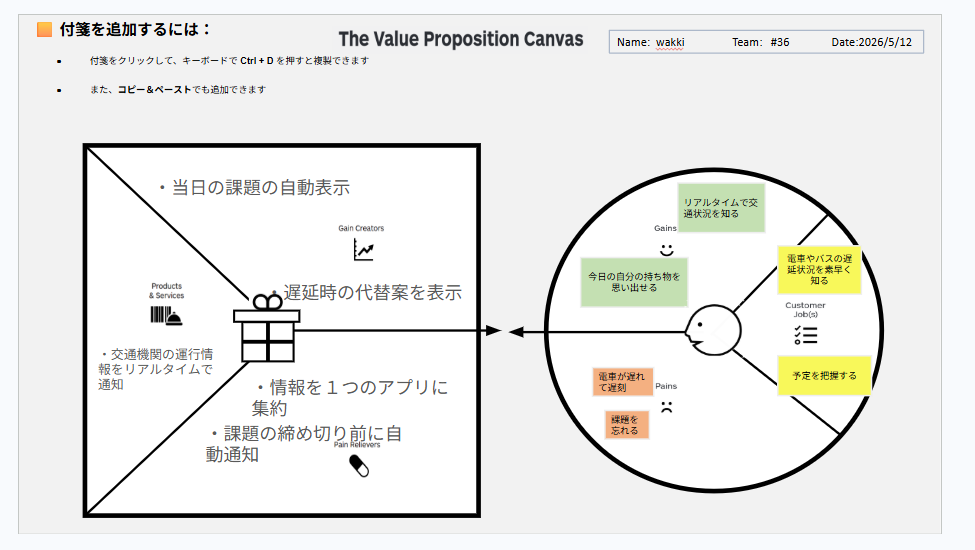

# VPC v1 - Ryohei Nishiwaki

> 「**自分や周りの人を顧客に設定**」したVPC。13週後の自分が欲しいもの・身近な人のために作りたいものを設計する。
> v1 でいい。完璧を目指さない。第6回でアップデート(v2)します。

---

## 1. 解決したい困りごとを 1つ 選ぶ

> [`bug-list.md`](./bug-list.md) の20個から、**「自分が一番これを解決したい!」と思うもの** を1つ選んでください。
> 1つに絞れなければ、複数候補を書いてOK(後で絞り込みます)。

**選んだ困りごと**:

電車遅延しがち

---

## 2. その解決策のアイデアを書く

> 選んだ困りごとに対する「**こうだったらいいのに**」を1つ書く。
> 現実性は気にせず、自由に発想。

**解決のアイデア**:

交通機関の運行情報をリアルタイムで通知し、情報を1つのアプリに集約。当日の課題の自動表示や、遅延時の代替案を表示してくれるアプリ。

---

## 3. VPC本体

> 上で選んだ「困りごと」と「解決のアイデア」を起点に、6要素を埋めていきます。

### 🟦 Customer Profile(顧客=自分自身)

#### Jobs(やりたいこと・動詞で書く)

- 電車やバスの遅延状況を素早く知る
- 予定を把握する

#### Pains(困っていること)

- 電車が遅れて遅刻
- 課題を忘れる

#### Gains(得たい未来・状態)

- リアルタイムで交通状況を知る
- 今日の自分の持ち物を思い出せる

---

### 🟧 Value Map(あなたが作るもの)

#### Products & Services

- 交通機関の運行情報をリアルタイムで通知

#### Pain Relievers

- 情報を1つのアプリに集約
- 課題の締め切り前に自動通知

#### Gain Creators

- 当日の課題の自動表示
- 遅延時の代替案を表示

---

## 4. Fit確認(整合チェック)

| Pains/Gains | ↔ | Pain Relievers / Gain Creators | チェック |
|---|---|---|---|
| 電車が遅れて遅刻 | ↔ | 情報を1つのアプリに集約 | ✓ |
| 課題を忘れる | ↔ | 課題の締め切り前に自動通知 | ✓ |
| リアルタイムで交通状況を知る | ↔ | 遅延時の代替案を表示 | ✓ |
| 今日の自分の持ち物を思い出せる | ↔ | 当日の課題の自動表示 | ✓ |

> 整合しないものは「自分が作りたいだけ」のプロダクトになりがち。
> 迷ったら AI大学講師に壁打ち。
